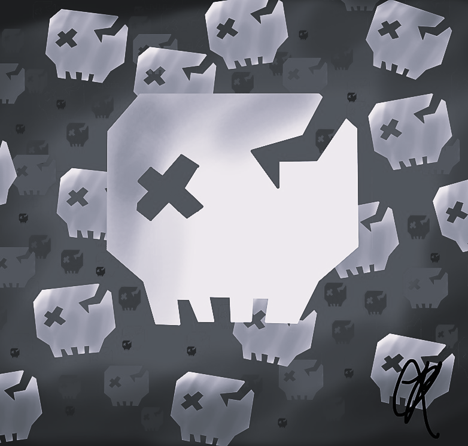
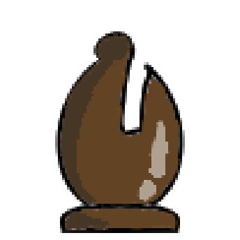

# Minuicee-s-Drawings
Markdown of all my digital drawings
## Golden festive cat

Fanart of the pet "golden festive cat" in the game Pet Simulator X in roblox
## Empyrean fox

Fanart of the pet "empyrean fox" in the game Pet Simulator X in roblox
## Abermillionen von Vielen (german)

 
Fanart of the badge "Hundred of many" in the game Doors in roblox
## It doesn't work

 
Fanart of the entity A-90 (jumpscare version) in the game Doors in roblox
## Red shark v4

 
Fanart of "shark v4" in the game Blox Fruits in roblox
## Troll face

 
Reference of the troll face meme
## Silhouette

Inspired by the cover of the song "Silhouette" - by pastel ghost and "Call me" - by plenka
## Springbonnie

Reference of the animatronic "Springbonnie" in the game Five Nights at Freddy's
## Poker

Wallpaper for my desktop I drew in poker style
## Chess set 1

 
Chess set for my first chess engine
## Chess set 2

Chess set for my second chess engine
